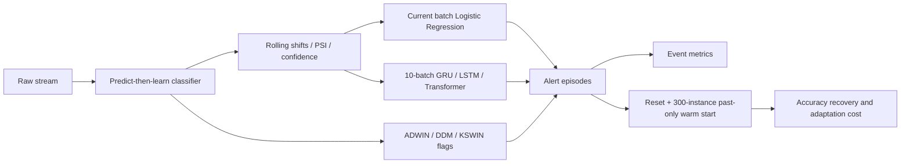

# DriftSentinel

DriftSentinel is a university research prototype for predicting concept-drift
onsets before a reactive detector fires. It learns from rolling stream and
classifier-behaviour statistics, measures warnings under a strict five-batch
horizon, and replays raw streams to quantify both recovery and adaptation cost.

## Architecture



At batch `t`, `target(t)=1` exactly when a recorded onset is in `(t,t+5]`.
The matching warning interval is exactly `[onset-5,onset)`: onset-minus-five is
valid and onset-minus-six is not.

## Models and detectors

- Logistic Regression receives only the current scaled rolling-feature vector,
  uses balanced class weights, and provides the non-sequential comparison.
- GRU and LSTM use one 48-unit recurrent layer over ten batches.
- Transformer uses a 48-dimensional projection, sinusoidal positions, one
  four-head encoder layer, and the final token.
- ADWIN, DDM, and KSWIN are the recorded binary reactive detector alarms.

All supervised models use chronological train/validation/test partitions,
train-only scaling, and validation-only threshold selection. Labels, drift
metadata, and detector flags never enter model inputs. Validation/test examples
may use rows immediately before their split as historical lookback; every
context row is in the past, the target and final input row belong to the
destination split, and no future observation enters `X`.

## Actual benchmark data

The original proposal listed Electricity, Airlines, Forest CoverType, and
USENET. The Phase 1 repository actually contained Elec2, INSECTS
abrupt-balanced, and SEA. The final benchmark truthfully evaluates the available
Elec2 and INSECTS streams plus regenerated abrupt and gradual SEA streams with
ten deterministic events each. It does not claim that Airlines, CoverType, or
USENET were evaluated.

Elec2 has no authoritative event onsets and all splits have zero positive
future targets. It is loaded and reported with `evaluation_valid=false`, but no
supervised model is presented as a meaningful trained drift predictor for it.
The INSECTS raw replay uses a documented verified mirror: 52,848 rows, 33
features, 6 classes, SHA-256
`e4819251b250a6fc1bf2a3798bbb7a1cbd2aff81d2ea34252a904c5266272fff`.
Checksum and parsed metadata are validated automatically.

## Metrics and adaptation replay

The pipeline reports F1 and probability-based PR-AUC, event lead time, warning
coverage, batch/episode FAR, and missed-drift rate. ADWIN/DDM/KSWIN PR-AUC is
N/A because Phase 1 provides only binary alarm flags, not continuous detector
scores suitable for a threshold curve.

One deduplicated alert episode produces one adaptation. The raw SEA and
INSECTS streams are replayed using one Hoeffding tree per policy. A trigger
resets the tree and warm-starts it on only the latest 300 already-labelled
instances. Recovery is the first five-batch rolling accuracy to reach 95% of
the pre-drift baseline. The report also includes total resets, resets per 100
evaluated batches, false resets, event-related resets, and adaptation precision.

## Final regenerated results

These are equal-dataset macro means: seeds are averaged within each dataset,
then the three event-labelled datasets are weighted equally. Recovery is mean
batches for observed recovery, accompanied by its event coverage. Binary-only
detector PR-AUC remains N/A.

| Method | F1 | PR-AUC | Lead | Warning coverage | Batch FAR | Miss rate | Recovery batches | Recovery coverage | Adapt./100 |
|---|---:|---:|---:|---:|---:|---:|---:|---:|---:|
| GRU | 0.1345 | 0.1039 | 1.83 | 0.3889 | 0.4972 | 0.6111 | 3.06 | 0.5556 | 3.6415 |
| Logistic Regression | 0.1068 | 0.0909 | 0.00 | 0.0000 | 0.6652 | 1.0000 | 6.00 | 0.1667 | 2.3592 |
| LSTM | 0.1222 | 0.0843 | 0.44 | 0.0556 | 0.7199 | 0.9444 | 14.50 | 0.2222 | 1.6890 |
| Transformer | 0.0797 | 0.1020 | 0.11 | 0.0556 | 0.3086 | 0.9444 | 4.75 | 0.1667 | 1.3425 |
| ADWIN | 0.0370 | N/A | 1.33 | 0.1667 | 0.0199 | 0.8333 | 20.17 | 0.6667 | 1.9670 |
| DDM | 0.0513 | N/A | 0.67 | 0.1667 | 0.0083 | 0.8333 | 31.50 | 0.6667 | 0.8777 |
| KSWIN | 0.0000 | N/A | 0.00 | 0.0000 | 0.0087 | 1.0000 | 11.00 | 0.1667 | 0.8466 |

GRU adds limited temporal benefit over Logistic Regression in the macro and
strict event views: higher F1 and PR-AUC, nonzero warning coverage, and lower
FAR. This is not universal superiority—pooled F1 slightly favours Logistic
Regression (0.1423 vs 0.1358), and GRU obtains its coverage with substantial
cost. Sixty of 67 pooled GRU adaptations are false, so fast observed recovery
cannot be separated from excessive reset frequency. DDM is much more
conservative but covers fewer events.

No Transformer bug was found in class weighting, checkpoint restoration,
sequence dimensions, masking, positional encoding, or logits/sigmoid usage. It
genuinely underperformed under sparse, imbalanced event supervision.

See [Experiments](docs/EXPERIMENTS.md), [Findings](docs/FINDINGS.md), the
[Methodology](docs/METHODOLOGY.md), and the
[Methodology audit](docs/METHODOLOGY_AUDIT.md) for full tables and interpretation.

## Reproduce

Python 3.11 is recommended. Direct dependency versions are pinned.

```bash
python3.11 -m venv .venv
source .venv/bin/activate
python -m pip install --upgrade pip
python -m pip install --no-cache-dir -r requirements.txt
python -m pip install --no-cache-dir -e .
pytest -q
python scripts/run_pipeline.py reproduce --quick
python scripts/run_pipeline.py reproduce
```

See [Reproducibility](docs/REPRODUCIBILITY.md) for seeds, hyperparameters,
dataset provenance, expected files, and clean-environment details. Presentation
and oral-exam material are in [Presentation Guide](docs/PRESENTATION_GUIDE.md)
and [Viva Q&A](docs/VIVA_QA.md).

## Project structure

```text
configs/default.yaml              scientific experiment configuration
outputs/                          tracked Phase 1 batch-level inputs
src/driftsentinel/data.py         targets, splits, scaling, sequences
src/driftsentinel/logistic.py     current-batch supervised baseline
src/driftsentinel/models/         GRU, LSTM, Transformer
src/driftsentinel/training.py     neural training and checkpoints
src/driftsentinel/evaluation.py   classification, event, adaptation metrics
src/driftsentinel/recovery.py     verified raw replay and real adaptation
src/driftsentinel/pipeline.py     complete experiment orchestration
src/driftsentinel/figures.py      final PNG/PDF figures
tests/                            regression and model tests
results/metrics/                  detailed generated metrics
results/tables/                   dataset, seed, macro, pooled summaries
results/figures/                  final plots
docs/                             audits, method, results, presentation guides
```

## Limitations

- Only three event-labelled datasets are evaluable, and only INSECTS is real.
- SEA episodes are reproducible but correlated within one generator family.
- INSECTS onsets are published instance positions mapped to batches.
- Elec2 cannot be event-scored without fabricating onset truth.
- Three seeds describe optimizer variation, not statistical significance.
- Thresholds are unstable and practical FAR/adaptation cost is high.
- Recovery is a faithful causal replay simulation, not a deployed service with
  delayed labels, compute constraints, or operational retraining approval.
